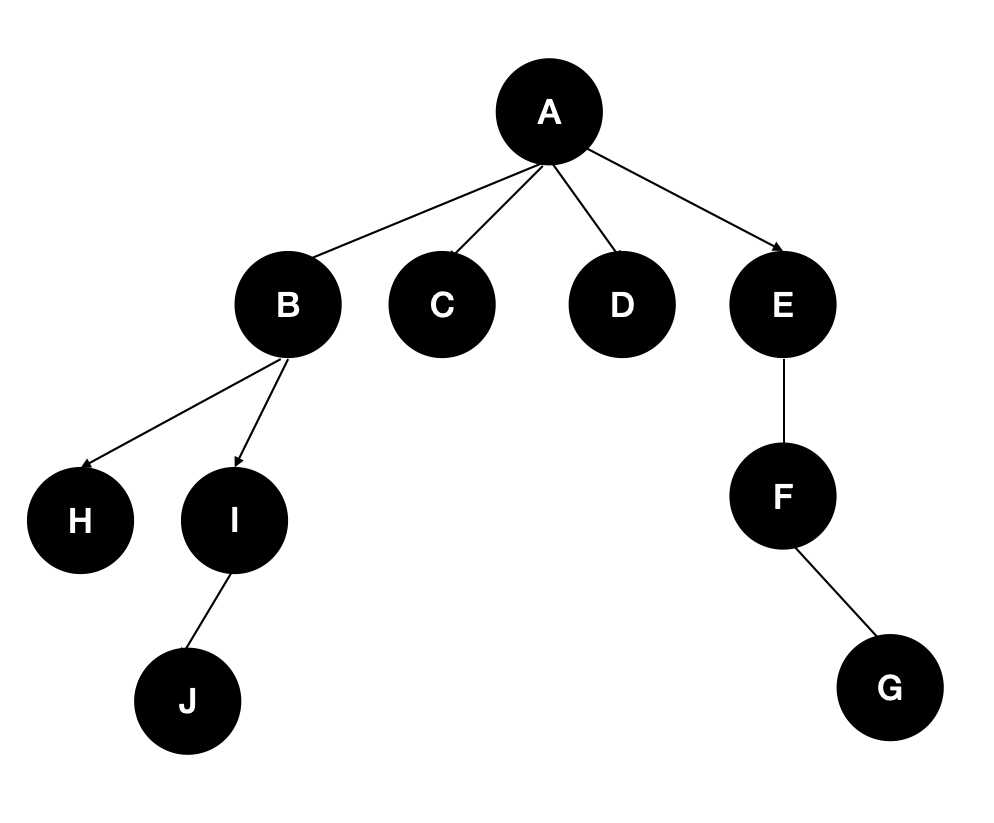

# Linux Basic Assignment
1. How to create a directory.
2. Create a directory called `linux`
3. How to create a file.
4. Create a file called `contents.txt` under `linux` directory
5. Insert 10 lines inside `contents.txt`
6. See the contents of the file
7. Print first 2 lines of the files
8. Print last 2 lines of the files
9. Print top two lines using tail
### Write the commands for the following tasks

1. Create the following tree structure
2. How many folders are created under A
3. Create a file called linux.txt under G directory from A dirctory
4. Move folder I to G directory from C directory
5. Delete B directory.
6. Delete F directory
7. How many folders are present inside E directory